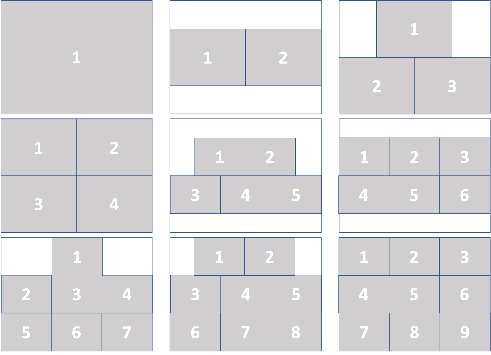

# **Яндекс.Контест**

### Ссылка на GH-Pages: https://navfront.github.io/PhotoFramesJS/

## **Задача**:

Есть участок стены, на которую решили повесить фоторамки. У данного участка известна ширина и высота.

Нужно написать функцию раскладки фоторамок на этом участке стены в зависимости от количества фоторамок.

Раскладка должна быть симметричной относительно вертикали, все фоторамки должны быть одинакового размера и иметь такие же соотношения высоты и ширины, как и кусок стены. Если фоторамок не хватает для заполнения строки, то такая строка должна быть расположена первой сверху. Пустое пространство выше и ниже строк должно иметь одинаковую высоту. Не должно быть пустого пространства между фоторамками.

## Примеры правильной раскладки:
\

Нумерация фоторамок идет сверху вниз и слева направо, в таком же порядке их должна вернуть функция. Координаты идут по x слева направо, по y – сверху вниз. В решении необходимо рассчитать размеры фоторамок и координаты креплении. Крепление всегда расположено посередине фоторамки по x, и в самом верху по y. Координаты креплений фоторамок и их размер нужно округлить до ближайших целых значений, используя `Math.round` (иначе решение может не проходить тесты).

Подсказка: количество колонок можно посчитать как `Math.ceil(Math.sqrt(n))`.

Далее описание функции и параметров дано на Typescript, но функцию требуется написать на JS.

`/**` \
 `* @param n - количество фоторамок` \
` * @param width - ширина области для фоторамок` \
` * @param height - высота области для фоторамок` \
` */` \
`module.exports = function(n: number, width: number, height: number): Photo[] {}` 

`type Photo = {` \
 `   width: number; // Ширина каждой фоторамки` \
`    height: number;  // Высота каждой фоторамки` \
`    x: number; // Положение крепления фоторамки по x относительно верхнего левого угла пространства на стене` \
`    y: number; // Положение крепления фоторамки по y относительно верхнего левого угла пространства на стене` \
`}` \
К примеру, если функция будет вызвана со следующими параметрами `solution(1, 100, 30)`, то она должна вернуть `[{ width: 100, height: 30, x: 50, y: 0}]`.
